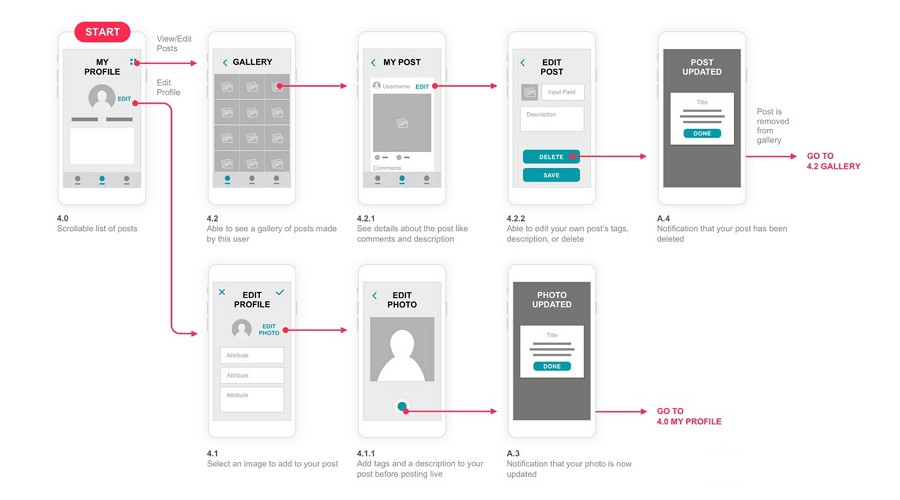

# Informações do Projeto
`TÍTULO DO PROJETO`  

......  COLOQUE AQUI O SEU TEXTO ......

`CURSO` 

......  COLOQUE AQUI O SEU TEXTO ......

## Participantes

> Inclua a lista dos membros da equipe com seus nomes completos.
>
> Os membros do grupo são: 
> - Cecília Junqueira
> - Gabriel Drummond
> - Guilherme Pinheiro
> - Gustavo Junqueira
> - Laura Vasconcelos
> - Rafael Nunes

# Estrutura do Documento

- [Informações do Projeto](#informações-do-projeto)
  - [Participantes](#participantes)
- [Estrutura do Documento](#estrutura-do-documento)
- [Introdução](#introdução)
  - [Problema](#problema)
  - [Objetivos](#objetivos)
  - [Justificativa](#justificativa)
  - [Público-Alvo](#público-alvo)
- [Especificações do Projeto](#especificações-do-projeto)
  - [Personas e Mapas de Empatia](#personas-e-mapas-de-empatia)
  - [Histórias de Usuários](#histórias-de-usuários)
  - [Requisitos](#requisitos)
    - [Requisitos Funcionais](#requisitos-funcionais)
    - [Requisitos não Funcionais](#requisitos-não-funcionais)
  - [Restrições](#restrições)
- [Projeto de Interface](#projeto-de-interface)
  - [User Flow](#user-flow)
  - [Wireframes](#wireframes)
- [Metodologia](#metodologia)
  - [Divisão de Papéis](#divisão-de-papéis)
  - [Ferramentas](#ferramentas)
  - [Controle de Versão](#controle-de-versão)
- [**############## SPRINT 1 ACABA AQUI #############**](#-sprint-1-acaba-aqui-)
- [Projeto da Solução](#projeto-da-solução)
  - [Tecnologias Utilizadas](#tecnologias-utilizadas)
  - [Arquitetura da solução](#arquitetura-da-solução)
- [Avaliação da Aplicação](#avaliação-da-aplicação)
  - [Plano de Testes](#plano-de-testes)
  - [Ferramentas de Testes (Opcional)](#ferramentas-de-testes-opcional)
  - [Registros de Testes](#registros-de-testes)
- [Referências](#referências)

# Introdução

## Problema
  A dificuldade de acesso ao estágio é um problema que muitos estudantes universitários encaram durante a faculdade devido a inúmeros fatores, que podem variar, por exemplo, de acordo com a área em que o indivíduo pretende seguir como profissional. É válido citar que a falta de orientação sobre como produzir um currículo, a divulgação ineficaz sobre vagas de estágio existentes, dificuldade de conciliar os horários das aulas com o do estágio e a falta de comunicação efetiva entre os estudantes e os contratantes são apenas uma das adversidades que geram e fomentam a dificuldade de arranjar estágio.
  
  Diante de tal situação, é evidente que esse problema precisa ser solucionado, uma vez que participar de um estágio é uma etapa fundamental para a formação de um profissional de alta qualidade, visto que o estudante adquire muito conhecimento com esse trabalho. Com isso, o difícil acesso a tal emprego pode promover a formação de profissionais desqualificados, que não saberão executar adequadamente suas respectivas funções, promovendo um desequilíbrio social e econômico.
  
  Assim, ao longo desse trabalho, o grupo se propõe a apresentar uma alternativa que torne o processo de busca por um estágio mais fácil e objetiva, tanto para os universitários, quanto para as empresas que querem contratar, para, então, contribuir para a melhora da formação dos profissionais do país.

> Nesse momento você deve apresentar o problema que a sua aplicação deve
> resolver. No entanto, não é a hora de comentar sobre a aplicação.
> Descreva também o contexto em que essa aplicação será usada, se
> houver: empresa, tecnologias, etc. Novamente, descreva apenas o que de
> fato existir, pois ainda não é a hora de apresentar requisitos
> detalhados ou projetos.
>
> Nesse momento, o grupo pode optar por fazer uso
> de ferramentas como Design Thinking, que permite um olhar de ponta a
> ponta para o problema.
>
> **Links Úteis**:
> - [Objetivos, Problema de pesquisa e Justificativa](https://medium.com/@versioparole/objetivos-problema-de-pesquisa-e-justificativa-c98c8233b9c3)
> - [Matriz Certezas, Suposições e Dúvidas](https://medium.com/educa%C3%A7%C3%A3o-fora-da-caixa/matriz-certezas-suposi%C3%A7%C3%B5es-e-d%C3%BAvidas-fa2263633655)
> - [Brainstorming](https://www.euax.com.br/2018/09/brainstorming/)

## Objetivos

Para solucionar essa chaga, temos como objetivo geral desenvolver um software que facilite a busca de estágio dos estudantes, de modo que faça com que a grande maioria dos indivíduos que usarem o programa criado encontrem um bom emprego, que seja edificador na sua formação profissional. 
	Alguns objetivos específicos que temos é:
- Criar um ambiente de divulgação das vagas de estágio disponível onde os requisitos apresentados sejam objetivos, de modo que contenha apenas as exigências que são de fato fundamentais para que os estudante trabalhe bem na empresa;
- Auxiliar os estudantes sobre como fazer um currículo (o que é importante colocar nele, quais atividades são válidas de serem mencionadas…);
- Auxiliar, principalmente os estudantes de áreas que o mercado de trabalho é fraco, a encontrarem empregos que são da sua área ou, ao menos, que são o mais próximo possível dela;
- Criar um ambiente onde o aluno pode pedir auxílio a outros estudantes que já têm estágio, com professores, com pessoas da área que pretende seguir, entre outros, sobre o que fazer para conseguir a contratação.

> Aqui você deve descrever os objetivos do trabalho indicando que o
> objetivo geral é desenvolver um software para solucionar o problema
> apresentado acima. Apresente também alguns (pelo menos 2) objetivos
> específicos dependendo de onde você vai querer concentrar a sua
> prática investigativa, ou como você vai aprofundar no seu trabalho.
> 
> **Links Úteis**:
> - [Objetivo geral e objetivo específico: como fazer e quais verbos utilizar](https://blog.mettzer.com/diferenca-entre-objetivo-geral-e-objetivo-especifico/)

## Justificativa
	Este problema é muito recorrente no nosso país, o que acarreta sérios problemas para a economia, pois, a partir do momento que os estudantes não conseguem arranjar bons estágios, eles não terão a oportunidade ter experiências de qualidade na área que eles pretendem seguir, tornando-os, então, profissionais frágeis que não são capazes de executarem bem suas funções. Com isso, a contribuição deles para a sociedade também será precária, dificultando o crescimento do país.
	Tendo isso em mente, consideramos fundamental trabalhar essa temática, para tentarmos encontrar e propor soluções que a minimizem, a fim de tornar os futuros profissionais do país de alta qualidade e, portanto, possibilitar o crescimento nacional.
	Para atingirmos tal fim, escolhemos os objetivos mencionados anteriormente pois, nas entrevistas que realizamos, eles foram apresentados como os principais obstáculos que fomentam o problema em discussão. Dessa forma, ao focarmos na busca de soluções para eles, estamos dando um significativo passo na busca em acabar com essa dificuldade que muitos jovens enfrentam atualmente.

> Descreva a importância ou a motivação para trabalhar com esta aplicação
> que você escolheu. Indique as razões pelas quais você escolheu seus
> objetivos específicos ou as razões para aprofundar em certos aspectos
> do software.
> 
> O grupo de trabalho pode fazer uso de questionários, entrevistas e
> dados estatísticos, que podem ser apresentados, com o objetivo de
> esclarecer detalhes do problema que será abordado pelo grupo.
>
> **Links Úteis**:
> - [Como montar a justificativa](https://guiadamonografia.com.br/como-montar-justificativa-do-tcc/)

## Público-Alvo

  As principais pessoas que pretendemos atingir e chamá-las para usar nossos software são, principalmente, os estudantes que estão em busca por estágio e as empresas que querem divulgar suas vagas de estágio disponíveis, de uma maneira que atinja um grande número de pessoas.
	No primeiro grupo do público-alvo, as pessoas que fazem parte dele podem ser tanto homens quanto mulheres, estão, na sua maioria, na faixa etária de 18 a 22 anos, estão cursando o ensino superior, a renda média é indefinida, bem como a classe social e a localização e são pessoas que têm o hábito de mexer nas redes sociais constantemente.
	O segundo grupo também é composto por homens e mulheres, apesar de, muitas vezes os homens predominarem, já que a maioria dos altos cargos das empresas (que são quem contrata) são ocupados por homens. Essas pessoas, em sua maioria, concluíram o ensino superior e têm mais de 40 anos. Elas fazem parte das classes mais altas da sociedade e também têm grande afinidade com os utensílios tecnológicos, usando-os constantemente (celulares, computadores, mídias sociais…).

> Descreva quem serão as pessoas que usarão a sua aplicação indicando os
> diferentes perfis. O objetivo aqui não é definir quem serão os
> clientes ou quais serão os papéis dos usuários na aplicação. A ideia
> é, dentro do possível, conhecer um pouco mais sobre o perfil dos
> usuários: conhecimentos prévios, relação com a tecnologia, relações
> hierárquicas, etc.
>
> Adicione informações sobre o público-alvo por meio de uma descrição
> textual, ou diagramas de personas, mapa de stakeholders, ou como o
> grupo achar mais conveniente.
> 
> **Links Úteis**:
> - [Público-alvo: o que é, tipos, como definir seu público e exemplos](https://klickpages.com.br/blog/publico-alvo-o-que-e/)
> - [Qual a diferença entre público-alvo e persona?](https://rockcontent.com/blog/diferenca-publico-alvo-e-persona/)
 
# Especificações do Projeto

  Nessa parte do documento, iremos apresentar quais personas/perfis criamos dos usuários da ferramentas que criaremos futuramente, para solucionar o problema discutido previamente. Ainda, apresentaremos quais os requisitos e desejos dos usuários sobre o que é fundamental que tenha no software, para que a solução que ele busca garantir seja efetiva. Para coletarmos essas informações, utilizamos as respostas obtidas no formulário e nas entrevistas realizadas com estudantes universitários e empresários sobre quais são as fragilidades nas ferramentas já existentes que visam facilitar o acesso ao estágio. Após isso, usamos o Miro para construir as personas e os mapas de empatias, além de usar essa plataforma como um ambiente para organizar visualmente as necessidades principais do público-alvo.

> Apresente uma visão geral do que será abordado nesta parte do
> documento, enumerando as técnicas e/ou ferramentas utilizadas para
> realizar a especificações do projeto

## Personas e Mapas de Empatia

	Ao longo das entrevistas que realizamos, identificamos três tipos de personas: os alunos que são de áreas em que a empregabilidade é baixa, os alunos de áreas que têm muitas vagas de emprego e os donos ou funcionários de empresas que são responsáveis por contratar estagiários.
	No aluno que é de uma área em que a empregabilidade é baixa, percebemos que ele quer arranjar um emprego, mas a escassez de vagas disponíveis, atrelada à falta de orientação sobre como fazer um currículo e sobre como se portar na entrevista de emprego, quais atividades extracurriculares fazer para se encaixar nas requisições da vaga à qual quer aplicar, entre outros, fomenta a dificuldade em conseguir um estágio. 
	No aluno que é de uma área com alta empregabilidade, percebemos que, apesar de tal realidade, a falta de informações claras sobre as vagas disponíveis e sobre os requisitos da vaga, por exemplo, dificultam a contratação. Ainda, a dificuldade de conciliar o horário de trabalho com o de aula se mostrou um empecilho tanto para esse aluno, como para o anterior.
	A terceira (e última) persona mostrou grande interesse em contratar jovens qualificados e esforçados para a sua empresa, porém, a comunicação ineficiente e a fraca divulgação das vagas disponíveis torna esse processo complicado e, muitas vezes, sem êxito.

PERSONA 1: Amanda tem 21 anos e é estudante de Relações Internacionais. Ela tem o sonho de se tornar uma profissional qualificada e de sucesso, com um bom emprego, além de querer expandir sua carreira internacionalmente. Entretanto, ela encara a dificuldade de não conseguir estágio, uma vez que a disponibilidade de emprego em sua área é muito baixa e a escassa divulgação das vagas disponíveis, com muitas informações confusas e prolixas sobre o emprego e suas requisições, dificultam o alcance do seu objetivo. Diante disso, a existência de uma plataforma que informe de maneira clara e objetiva quais as vagas disponíveis (ou as vagas com funções mais próximas das da sua área), com um bom auxílio sobre o que deve ser feito para facilitar o processo, a ajudaria imensamente.

PERSONA 2: Arthur, de 19 anos, cursa Ciência da Computação e sonha em se tornar um desenvolvedor de grande renome e, para atingir tal fim, ele considera o estágio como sendo fundamental para ele adquirir mais conhecimento sobre a área. Ele tem grande facilidade com tecnologia e já possui um conhecimento básico sobre programação muito estabilizado. Contudo, apesar da oferta de emprego de sua área ser muito abundante, a má divulgação das vagas disponíveis também é um fator prejudicial na sua busca por um emprego. Assim, uma ferramenta que divulgue os estágios disponíveis de uma maneira clara e centralizada o ajudaria a atingir seu objetivo.

PERSONA 3: Eneas, de 51 anos, é um empreendedor que tem grande interesse pelas mudanças tecnológicas que o mundo encara constantemente e quer sempre aplicá-las em seus negócios, para que estes sempre prosperem. Ele sonha em expandir suas empresas internacionalmente e acredita que, ao contratar jovens qualificados, estes vão saber bem como adaptar a empresa às modernidades, para, assim, atingir tal fim, Diante disso, ele sempre tenta contratar estagiários altamente qualificados e comprometidos com o trabalho, mas a falta de uma boa comunicação entre as empresas e os alunos, sobre as vagas de estágio disponíveis, torna as contratações complicadas. Com isso, um ambiente onde seja centralizada e efetiva a divulgação das vagas disponíveis (realidade que não é comum até então), de modo onde o contato com os alunos seja fácil e objetivo, minimizaria essa realidade problemática.

> Relacione as personas identificadas no seu projeto e os respectivos mapas de empatia. Lembre-se que 
> você deve ser enumerar e descrever precisamente e de forma
> personalizada todos os principais envolvidos com a solução almeja. 
> 
> Para tanto, baseie-se tanto nos documentos disponibilizados na disciplina
> e/ou nos seguintes links:
>
> **Links Úteis**:
> - [Persona x Público-alvo](https://flammo.com.br/blog/persona-e-publico-alvo-qual-a-diferenca/)
> - [O que é persona?](https://resultadosdigitais.com.br/blog/persona-o-que-e/)
> - [Rock Content](https://rockcontent.com/blog/personas/)
> - [Hotmart](https://blog.hotmart.com/pt-br/como-criar-persona-negocio/)
> - [Mapa de Empatia](https://resultadosdigitais.com.br/blog/mapa-da-empatia/)
> - [Como fazer um mapa de empatia - Vídeo](https://www.youtube.com/watch?v=JlKHGpVoA2Y)
> 
> 
> **Exemplo de Persona**
> 
> 
> 
> Fonte: [Como criar uma persona para o seu negócio](https://raissaviegas.com.br/como-criar-uma-persona/)

## Histórias de Usuários

- Eu, Amanda, como uma aluna com dificuldade de encontrar vagas de estágio disponíveis na minha área, quero uma plataforma que seja centralizada e clara na divulgação das vagas disponíveis, bem como dos requisitos dela, para que eu consiga arrumar um bom estágio, para, então, eu aprimorar minha qualificação profissional.

- Eu, Arthur, como um estudante de uma área com abundantes vagas disponíveis, mas que tem dificuldade de saber quais vagas de estágio estão disponíveis, devido à má organização da divulgação destas, quero ter acesso a uma ferramenta que solucione esse problema, tornando a divulgação dos estágios objetiva, para possibilitar que eu comece a trabalhar e, com isso, adquira mais conhecimento para me tornar um profissional de sucesso.

- Eu, Eneas, como um empresário que pretende usar a plataforma a ser criada, quero que esta torne a divulgação das vagas de estágio da minha empresa efetiva e rápida, abrangendo muitos indivíduos, para que eu consiga encontrar jovens capacitados e esforçados para trabalhar na minha empresa, para, assim, poder torná-los excelentes profissionais no futuro e, com isso, poder mantê-los como meus funcionários, contribuindo para o crescimento da empresa.

Com base na análise das personas forma identificadas as seguintes histórias de usuários:

|EU COMO... `PERSONA`| QUERO/PRECISO ... `FUNCIONALIDADE` |PARA ... `MOTIVO/VALOR`                 |
|--------------------|------------------------------------|----------------------------------------|
|Usuário do sistema  | Registrar minhas tarefas           | Não esquecer de fazê-las               |
|Administrador       | Alterar permissões                 | Permitir que possam administrar contas |

> Apresente aqui as histórias de usuário que são relevantes para o
> projeto de sua solução. As Histórias de Usuário consistem em uma
> ferramenta poderosa para a compreensão e elicitação dos requisitos
> funcionais e não funcionais da sua aplicação. Se possível, agrupe as
> histórias de usuário por contexto, para facilitar consultas
> recorrentes à essa parte do documento.
>
> **Links Úteis**:
> - [Histórias de usuários com exemplos e template](https://www.atlassian.com/br/agile/project-management/user-stories)
> - [Como escrever boas histórias de usuário (User Stories)](https://medium.com/vertice/como-escrever-boas-users-stories-hist%C3%B3rias-de-usu%C3%A1rios-b29c75043fac)

## Requisitos

As tabelas que se seguem apresentam os requisitos funcionais e não funcionais que detalham o escopo do projeto.

### Requisitos Funcionais

|ID    | Descrição do Requisito  | Prioridade |
|------|-----------------------------------------|----|
|RF-001| Permitir que o usuário informe a área em que ele cursa, para filtrar as vagas de estágios disponíveis nela. | ALTA | 
|RF-002| Deve mostrar todas as vagas disponíveis por área. | ALTA |
|RF-003| Deve informar apenas as requisições que são extremamente essenciais para um indivíduo poder ocupar a vaga.| ALTA |
|RF-004| Dar orientações sobre como fazer um currículo (quais informações pessoais e atividades extracurriculares são válidas colocar, por exemplo).| ALTA |
|RF-005| A divulgação das vagas disponíveis deve ser muito intensa, centralizada num só espaço e de uma maneira muito clara.| ALTA |
|RF-006| Deve ter um ambiente onde os alunos que buscam emprego possam conversar com profissionais da área que pretendem seguir e com alunos que já têm estágio, de modo que sejam auxiliados sobre quais ações tomar para conseguir uma fácil contratação.| MÉDIA |
|RF-007| Deve apresentar uma modalidade em que o software apresenta os estágios disponíveis que sejam conciliados com o horário de aula do aluno.| MÉDIA |
|RF-008| Uma aba que dê instruções sobre como se preparar para as entrevistas de emprego.| MÉDIA |

### Requisitos não Funcionais

|ID     | Descrição do Requisito  |Prioridade |
|-------|-------------------------|----|
|RNF-001| Deve ser responsivo, para rodar em aparelhos móveis. | ALTA | 
|RNF-002| Deve retornar um resultado para a solicitação do usuário de busca por empregos disponíveis em 5 segundos. |  BAIXA | 
|RNF-003| Deve ser compilado e rodado em qualquer navegador. |  MÉDIA | 

> Com base nas Histórias de Usuário, enumere os requisitos da sua
> solução. Classifique esses requisitos em dois grupos:
>
> - [Requisitos Funcionais (RF)](https://pt.wikipedia.org/wiki/Requisito_funcional):
>   correspondem a uma funcionalidade que deve estar presente na
>   plataforma (ex: cadastro de usuário).
>
> - [Requisitos Não Funcionais (RNF)](https://pt.wikipedia.org/wiki/Requisito_n%C3%A3o_funcional):
>   correspondem a uma característica técnica, seja de usabilidade,
>   desempenho, confiabilidade, segurança ou outro (ex: suporte a
>   dispositivos iOS e Android).
>
> Lembre-se que cada requisito deve corresponder à uma e somente uma
> característica alvo da sua solução. Além disso, certifique-se de que
> todos os aspectos capturados nas Histórias de Usuário foram cobertos.
> 
> **Links Úteis**:
> 
> - [O que são Requisitos Funcionais e Requisitos Não Funcionais?](https://codificar.com.br/requisitos-funcionais-nao-funcionais/)
> - [O que são requisitos funcionais e requisitos não funcionais?](https://analisederequisitos.com.br/requisitos-funcionais-e-requisitos-nao-funcionais-o-que-sao/)

## Restrições

O projeto está restrito pelos itens apresentados na tabela a seguir.

|ID| Restrição                                             |
|--|-------------------------------------------------------|
|01| O projeto deverá ser entregue até o final do semestre |
|02| Não pode ser desenvolvido um módulo de backend        |

> Enumere as restrições à sua solução. Lembre-se de que as restrições
> geralmente limitam a solução candidata.
> 
> **Links Úteis**:
> - [O que são Requisitos Funcionais e Requisitos Não Funcionais?](https://codificar.com.br/requisitos-funcionais-nao-funcionais/)
> - [O que são requisitos funcionais e requisitos não funcionais?](https://analisederequisitos.com.br/requisitos-funcionais-e-requisitos-nao-funcionais-o-que-sao/)

# Projeto de Interface

	Durante a coleta de informações que realizamos ao longo das entrevistas, a grande maioria dos entrevistados citaram a falta de objetividade sobre os requisitos das vagas e de centralização da divulgação das vagas como dois dos principais problemas que fomentam a dificuldade que o estudante encara de encontrar um estágio. Dessa forma, ao pensarmos como seria as interfaces do site, decidimos deixar a página principal com “cards” das vagas disponíveis para os usuários estudantes e ainda disponibilizar a ferramenta de filtrar os estágios de acordo com a área, para facilitar a busca por um emprego.

> Apresente as principais interfaces da solução. Discuta como 
> foram elaboradas de forma a atender os requisitos funcionais, não
> funcionais e histórias de usuário abordados nas [Especificações do
> Projeto](#especificações-do-projeto).

## User Flow

......  INCLUA AQUI O DIAGRAMA COM O FLUXO DO USUÁRIO NA APLICAÇÃO ......

> Fluxo de usuário (User Flow) é uma técnica que permite ao desenvolvedor
> mapear todo fluxo de telas do site ou app. Essa técnica funciona
> para alinhar os caminhos e as possíveis ações que o usuário pode
> fazer junto com os membros de sua equipe.
>
> **Links Úteis**:
> - [User Flow: O Quê É e Como Fazer?](https://medium.com/7bits/fluxo-de-usu%C3%A1rio-user-flow-o-que-%C3%A9-como-fazer-79d965872534)
> - [User Flow vs Site Maps](http://designr.com.br/sitemap-e-user-flow-quais-as-diferencas-e-quando-usar-cada-um/)
> - [Top 25 User Flow Tools & Templates for Smooth](https://www.mockplus.com/blog/post/user-flow-tools)
>
> **Exemplo**:
> 
> 

## Wireframes

......  INCLUA AQUI OS WIREFRAMES DAS TELAS DA APLICAÇÃO COM UM BREVE DESCRITIVO ......
 

> Wireframes são protótipos das telas da aplicação usados em design de interface para sugerir a
> estrutura de um site web e seu relacionamentos entre suas
> páginas. Um wireframe web é uma ilustração semelhante ao
> layout de elementos fundamentais na interface.
> 
> **Links Úteis**:
> - [Ferramentas de Wireframes](https://rockcontent.com/blog/wireframes/)
> - [Figma](https://www.figma.com/)
> - [Adobe XD](https://www.adobe.com/br/products/xd.html#scroll)
> - [MarvelApp](https://marvelapp.com/developers/documentation/tutorials/)
> 
> **Exemplo**:
> 
> 

# Metodologia

......  COLOQUE AQUI O SEU TEXTO ......

> Nesta parte do documento, você deve apresentar a metodologia 
> adotada pelo grupo, descrevendo o processo de trabalho baseado nas metodologias ágeis, 
> a divisão de papéis e tarefas, as ferramentas empregadas e como foi realizada a
> gestão de configuração do projeto via GitHub.
>
> Coloque detalhes sobre o processo de Design Thinking e a implementação do Framework Scrum seguido
> pelo grupo. O grupo poderá fazer uso de ferramentas on-line para acompanhar
> o andamento do projeto, a execução das tarefas e o status de desenvolvimento
> da solução.
> 
> **Links Úteis**:
> - [Tutorial Trello](https://trello.com/b/8AygzjUA/tutorial-trello)
> - [Gestão ágil de projetos com o Trello](https://www.youtube.com/watch?v=1o9BOMAKBRE)
> - [Gerência de projetos - Trello com Scrum](https://www.youtube.com/watch?v=DHLA8X_ujwo)
> - [Tutorial Slack](https://slack.com/intl/en-br/)

## Divisão de Papéis

Divisão das tarefas:
CECÍLIA: Product Owner: Responsável por estabelecer um canal de comunicação entre o cliente e a equipe
GABRIEL: Desenvolvedor: Responsável por desenvolver o produto dentro do prazo de entrega.
GUILHERME: Scrum Master: responsável pela organização do grupo e projeto.
GUSTAVO: Desenvolvedor: Responsável por desenvolver o produto dentro do prazo de entrega
LAURA: Desenvolvedor: Responsável por desenvolver o produto dentro do prazo de entrega
RAFAEL: Desenvolvedor: Responsável por desenvolver o produto dentro do prazo de entrega

> Apresente a divisão de papéis e tarefas entre os membros do grupo.
>
> **Links Úteis**:
> - [11 Passos Essenciais para Implantar Scrum no seu Projeto](https://mindmaster.com.br/scrum-11-passos/)
> - [Scrum em 9 minutos](https://www.youtube.com/watch?v=XfvQWnRgxG0)

## Ferramentas

Miro (Processo de Design Thinking): https://miro.com/app/board/uXjVOBuGoNA=
GitHub: https://github.com/ICEI-PUC-Minas-PPLCC-TI/tiaw-ppl-cc-m-20221-t2-g3-dificuldade-de-acesso-a-estagio.git
Wireframe versão mobile: https://www.figma.com/file/lDMiBl8IVrLb0GsVEUYzDU/Untitled?node-id=0%3A1
Wireframe versão computador: https://www.figma.com/file/KviMFcISyLUqQwj2PMSTvv/Wireframes---sprint-1---TIAW

| Ambiente  | Plataforma              |Link de Acesso |
|-----------|-------------------------|---------------|
|Processo de Design Thinkgin  | Miro |  https://miro.com/app/board/uXjVOBuGoNA= | 
|Repositório de código | GitHub | https://github.com/ICEI-PUC-Minas-PPLCC-TI/tiaw-ppl-cc-m-20221-t2-g3-dificuldade-de-acesso-a-estagio.git | 
|Wireframe - mobile | Figma |  https://www.figma.com/file/lDMiBl8IVrLb0GsVEUYzDU/Untitled?node-id=0%3A1 | 
|Wireframe - computador | Figma | https://www.figma.com/file/KviMFcISyLUqQwj2PMSTvv/Wireframes---sprint-1---TIAW |
|User flow | Flow Map |https://app.flowmapp.com/share/421fd87e605b036153f35cd533795fb1/userflow/186513/ |

>
> Liste as ferramentas empregadas no desenvolvimento do
> projeto, justificando a escolha delas, sempre que possível.
> 
> As ferramentas empregadas no projeto são:
> 
> - Editor de código.
> - Ferramentas de comunicação
> - Ferramentas de diagramação
> - Plataforma de hospedagem
> 
> O editor de código foi escolhido porque ele possui uma integração com o
> sistema de versão. As ferramentas de comunicação utilizadas possuem
> integração semelhante e por isso foram selecionadas. Por fim, para criar
> diagramas utilizamos essa ferramenta por melhor captar as
> necessidades da nossa solução.
> 
> **Links Úteis - Hospedagem**:
> - [Getting Started with Heroku](https://devcenter.heroku.com/start)
> - [Crie seu Site com o HostGator](https://www.hostgator.com.br/como-publicar-seu-site)
> - [GoDady](https://br.godaddy.com/how-to)
> - [GitHub Pages](https://pages.github.com/)

## Controle de Versão

Versão: 1.0

> Discuta como a configuração do projeto foi feita na ferramenta de
> versionamento escolhida. Exponha como a gerência de tags, merges,
> commits e branchs é realizada. Discuta como a gerência de issues foi
> realizada.
> A ferramenta de controle de versão adotada no projeto foi o
> [Git](https://git-scm.com/), sendo que o [Github](https://github.com)
> foi utilizado para hospedagem do repositório `upstream`.
> 
> O projeto segue a seguinte convenção para o nome de branchs:
> 
> - `master`: versão estável já testada do software
> - `unstable`: versão já testada do software, porém instável
> - `testing`: versão em testes do software
> - `dev`: versão de desenvolvimento do software
> 
> Quanto à gerência de issues, o projeto adota a seguinte convenção para
> etiquetas:
> 
> - `bugfix`: uma funcionalidade encontra-se com problemas
> - `enhancement`: uma funcionalidade precisa ser melhorada
> - `feature`: uma nova funcionalidade precisa ser introduzida
>
> **Links Úteis**:
> - [Tutorial GitHub](https://guides.github.com/activities/hello-world/)
> - [Git e Github](https://www.youtube.com/playlist?list=PLHz_AreHm4dm7ZULPAmadvNhH6vk9oNZA)
> - [5 Git Workflows & Branching Strategy to deliver better code](https://zepel.io/blog/5-git-workflows-to-improve-development/)
>
> **Exemplo - GitHub Feature Branch Workflow**:
>
> 

# **############## SPRINT 1 ACABA AQUI #############**

# Projeto da Solução

......  COLOQUE AQUI O SEU TEXTO ......

## Tecnologias Utilizadas

......  COLOQUE AQUI O SEU TEXTO ......

> Descreva aqui qual(is) tecnologias você vai usar para resolver o seu
> problema, ou seja, implementar a sua solução. Liste todas as
> tecnologias envolvidas, linguagens a serem utilizadas, serviços web,
> frameworks, bibliotecas, IDEs de desenvolvimento, e ferramentas.
> Apresente também uma figura explicando como as tecnologias estão
> relacionadas ou como uma interação do usuário com o sistema vai ser
> conduzida, por onde ela passa até retornar uma resposta ao usuário.
> 
> Inclua os diagramas de User Flow, esboços criados pelo grupo
> (stoyboards), além dos protótipos de telas (wireframes). Descreva cada
> item textualmente comentando e complementando o que está apresentado
> nas imagens.

## Arquitetura da solução

......  COLOQUE AQUI O SEU TEXTO E O DIAGRAMA DE ARQUITETURA .......

> Inclua um diagrama da solução e descreva os módulos e as tecnologias
> que fazem parte da solução. Discorra sobre o diagrama.
> 
> **Exemplo do diagrama de Arquitetura**:
> 
> 

# Avaliação da Aplicação

......  COLOQUE AQUI O SEU TEXTO ......

> Apresente os cenários de testes utilizados na realização dos testes da
> sua aplicação. Escolha cenários de testes que demonstrem os requisitos
> sendo satisfeitos.

## Plano de Testes

......  COLOQUE AQUI O SEU TEXTO ......

> Enumere quais cenários de testes foram selecionados para teste. Neste
> tópico o grupo deve detalhar quais funcionalidades avaliadas, o grupo
> de usuários que foi escolhido para participar do teste e as
> ferramentas utilizadas.
> 
> **Links Úteis**:
> - [IBM - Criação e Geração de Planos de Teste](https://www.ibm.com/developerworks/br/local/rational/criacao_geracao_planos_testes_software/index.html)
> - [Práticas e Técnicas de Testes Ágeis](http://assiste.serpro.gov.br/serproagil/Apresenta/slides.pdf)
> -  [Teste de Software: Conceitos e tipos de testes](https://blog.onedaytesting.com.br/teste-de-software/)

## Ferramentas de Testes (Opcional)

......  COLOQUE AQUI O SEU TEXTO ......

> Comente sobre as ferramentas de testes utilizadas.
> 
> **Links Úteis**:
> - [Ferramentas de Test para Java Script](https://geekflare.com/javascript-unit-testing/)
> - [UX Tools](https://uxdesign.cc/ux-user-research-and-user-testing-tools-2d339d379dc7)

## Registros de Testes

......  COLOQUE AQUI O SEU TEXTO ......

> Discorra sobre os resultados do teste. Ressaltando pontos fortes e
> fracos identificados na solução. Comente como o grupo pretende atacar
> esses pontos nas próximas iterações. Apresente as falhas detectadas e
> as melhorias geradas a partir dos resultados obtidos nos testes.

# Referências

......  COLOQUE AQUI O SEU TEXTO ......

> Inclua todas as referências (livros, artigos, sites, etc) utilizados
> no desenvolvimento do trabalho.
> 
> **Links Úteis**:
> - [Formato ABNT](https://www.normastecnicas.com/abnt/trabalhos-academicos/referencias/)
> - [Referências Bibliográficas da ABNT](https://comunidade.rockcontent.com/referencia-bibliografica-abnt/)
